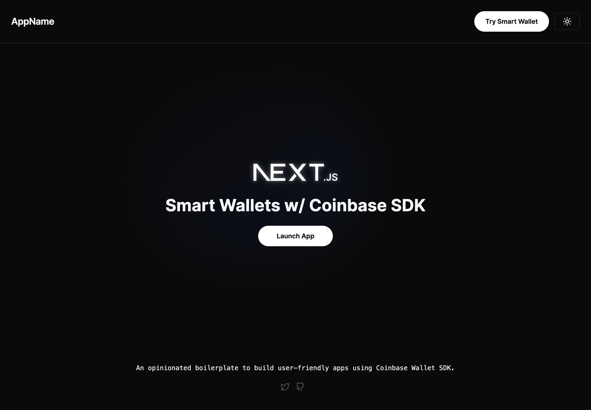

# SmartWallets Boilerplate with Next 14 & Coinbase SDK



An opinionated boilerplate to build user-friendly apps using Coinbase Wallet SDK.


## Deployment

```bash
npm run dev
# or
pnpm dev
```

Open [http://localhost:3000](http://localhost:3000) with your browser to see the result.

You can start editing the page by modifying `app/(Home)/page.tsx`. The page auto-updates as you edit the file.

## Learn More

To learn more, take a look at the following resources:

- [Next.js Documentation](https://nextjs.org/docs) - Learn about Next.js features and API.
- [Smart Wallet Docs](https://www.smartwallet.dev/why) - Learn about why Smart Wallets and it's current capabilities.
- [Coinbase SDK](https://docs.cloud.coinbase.com/wallet-sdk/docs/welcome) - Learn more about Coinbase SDK.

## Contributing

This repository is open source and welcomes contributions from the
community.

<!-- prettier-ignore -->
> [!NOTE] 
> If your change also requires core changes to the interaction with the Coinbase Wallet SDK [beta], please reach out
> and we can work together to make the necessary changes to fit the latest SDK release.

<!-- prettier-ignore-end -->

1. Fork and clone the repository
2. Ensure you have the LTS version of Node.js installed, as well as the latest
   version of [pnpm](https://pnpm.io).
3. Install the project dependencies by running `pnpm install`.
4. Implement your changes, as well as any documentation or tests that are
   required.
5. Create a changeset for your changes by running `pnpm changeset`.
6. Open a pull request with your changes and changeset.